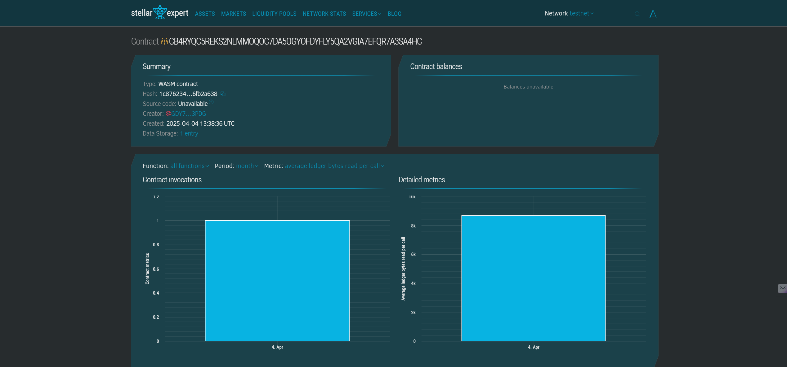

# Blockchain-Based Social Media Rewards

## Smart Contract

Contract Add = CB4RYQC5REKS2NLMMOQOC7DA5OGYOFDYFLY5QA2VGIA7EFQR7A3SA4HC

https://stellar.expert/explorer/testnet/contract/CB4RYQC5REKS2NLMMOQOC7DA5OGYOFDYFLY5QA2VGIA7EFQR7A3SA4HC

## Project Description

The Blockchain-Based Social Media Rewards system is a decentralized application built on the Stellar blockchain using the Soroban SDK. This smart contract enables content creators and social media users to be rewarded for their contributions, engagements, and interactions within a social media platform. The system creates a transparent, immutable, and fair ecosystem for distributing rewards based on predefined metrics and community engagement.

## Project Vision

Our vision is to revolutionize how value is distributed in social media ecosystems by leveraging blockchain technology. Traditional social media platforms extract significant value from user-generated content while offering limited compensation to creators. By implementing a decentralized rewards system, we aim to:

1. Create a more equitable distribution of value among all participants
2. Incentivize high-quality content creation and meaningful engagement
3. Reduce centralized control over rewards mechanisms
4. Foster a community-driven approach to content valuation
5. Provide transparent and immutable record-keeping of social interactions and their corresponding rewards

## Key Features

### Content Reward Management
- **Content Registration**: Creators can register their content on the blockchain with unique identifiers
- **Engagement Tracking**: Track likes, shares, comments, and other engagement metrics
- **Time-based Decay**: Implement algorithms that account for content freshness and longevity
- **Multi-tier Reward Structure**: Different reward tiers based on creator status and content quality

### User Reputation System
- **Reputation Scores**: Calculate and store user reputation based on contribution quality and community feedback
- **Sybil Resistance**: Mechanisms to prevent gaming the system through multiple accounts
- **Historical Performance**: Track user contribution history and reward patterns
- **Staking Mechanism**: Allow users to stake tokens to validate their identity and commitment

### Community Governance
- **Proposal System**: Community members can propose changes to reward algorithms
- **Voting Mechanisms**: Token-weighted voting on important platform decisions
- **Parameter Adjustment**: Community-controlled parameters for reward distribution
- **Dispute Resolution**: Transparent processes for resolving disputes about rewards

### Token Economics
- **Reward Token**: Native token for distributing rewards to users
- **Token Utility**: Various platform utilities for the reward tokens
- **Tokenized Reputation**: Reputation as a non-transferable token with governance rights
- **Liquidity Pools**: Integration with DEXs for token liquidity

### Technical Infrastructure
- **Scalability Solutions**: Optimized for handling high transaction volumes
- **Interoperability**: Ability to connect with other blockchain platforms and traditional social media
- **Privacy Controls**: User-controlled privacy settings for activity and reward information
- **Analytics Dashboard**: Real-time metrics and analytics for users and platform administrators

### Security Features
- **Smart Contract Auditing**: Regular security audits of the codebase
- **Multi-signature Requirements**: For administrative functions and large transactions
- **Rate Limiting**: Prevent spam and abuse of the system
- **Upgrade Mechanism**: Secure protocol for contract upgrades while preserving data integrity